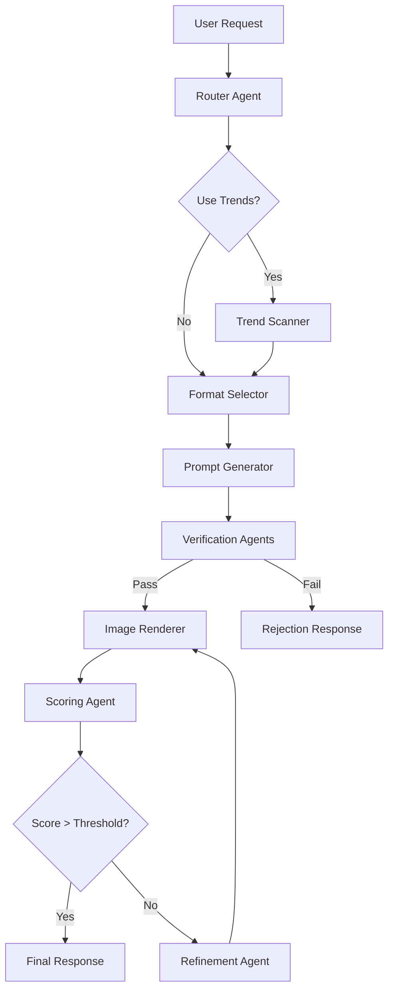
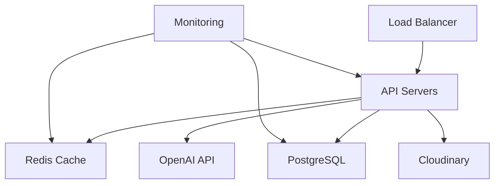

# Architecture Documentation

## Overview

The DSPy Meme Generation pipeline is built on a modular, event-driven architecture that leverages DSPy's declarative approach to AI development. The system is designed for scalability, maintainability, and extensibility.

## Core Components

### 1. Router Agent

The central coordinator that analyzes user requests and orchestrates the meme generation pipeline.

```python
class RouterAgent(dspy.Module):
    def __init__(self):
        self.router = dspy.Predict(
            "Given a user request {request}, identify meme elements, "
            "verification requirements, and generation approach."
        )
    
    def forward(self, request: str) -> Dict[str, Any]:
        return {
            "topic": str,
            "format": Optional[str],
            "verification_needs": Dict[str, bool],
            "constraints": Dict[str, Any],
            "generation_approach": str
        }
```

### 2. Verification Agents

A collection of specialized agents that ensure content quality and appropriateness.

#### Factuality Agent
```python
class FactualityAgent(dspy.Module):
    def forward(self, concept: str, topic: str) -> Dict[str, Any]:
        return {
            "is_factual": bool,
            "confidence": float,
            "factual_issues": List[str],
            "corrections": List[str]
        }
```

#### Instruction Following Agent
```python
class InstructionFollowingAgent(dspy.Module):
    def forward(self, concept: Dict[str, Any], constraints: Dict[str, Any]) -> Dict[str, Any]:
        return {
            "constraints_met": bool,
            "violations": List[str],
            "suggestions": List[str]
        }
```

#### Appropriateness Agent
```python
class AppropriatenessAgent(dspy.Module):
    def forward(self, concept: str) -> Dict[str, Any]:
        return {
            "is_appropriate": bool,
            "concerns": List[str],
            "alternatives": List[str]
        }
```

### 3. Generation Pipeline

The main sequence of operations for meme generation.

```python
class MemeGenerationPipeline:
    def __init__(self):
        self.router = RouterAgent()
        self.trend_scanner = TrendScanningAgent()
        self.format_selector = FormatSelectionAgent()
        self.prompt_generator = PromptGenerationAgent()
        self.image_renderer = ImageRenderingAgent()
        self.verification_agents = [
            FactualityAgent(),
            InstructionFollowingAgent(),
            AppropriatenessAgent()
        ]
        self.scorer = ScoringAgent()
        self.refinement_agent = RefinementLoopAgent()
    
    async def generate(self, request: Dict[str, Any]) -> Dict[str, Any]:
        # 1. Route request
        plan = await self.router(request)
        
        # 2. Scan trends if needed
        if plan.get("use_trends"):
            trends = await self.trend_scanner()
        
        # 3. Select format
        format_selection = await self.format_selector(plan, trends)
        
        # 4. Generate prompts
        prompts = await self.prompt_generator(plan, format_selection)
        
        # 5. Verify content
        verification_results = await self._verify_content(prompts)
        
        # 6. Generate image
        if verification_results["is_appropriate"]:
            meme = await self.image_renderer(prompts)
            
            # 7. Score and refine
            scored_meme = await self.scorer(meme)
            if scored_meme["final_score"] < plan.get("quality_threshold", 0.8):
                meme = await self.refinement_agent(scored_meme)
            
            return {"status": "success", "meme": meme}
        else:
            return {
                "status": "rejected",
                "reason": verification_results["concerns"]
            }
```

## Data Flow



## Database Schema

### Meme Templates
```sql
CREATE TABLE meme_templates (
    id SERIAL PRIMARY KEY,
    name VARCHAR(100) NOT NULL,
    description TEXT,
    format_type VARCHAR(50) NOT NULL,
    structure JSONB,
    popularity_score FLOAT,
    created_at TIMESTAMP NOT NULL DEFAULT NOW(),
    updated_at TIMESTAMP NOT NULL DEFAULT NOW()
);
```

### Generated Memes
```sql
CREATE TABLE generated_memes (
    id SERIAL PRIMARY KEY,
    template_id INTEGER REFERENCES meme_templates(id),
    topic VARCHAR(255),
    caption TEXT,
    image_prompt TEXT,
    image_url VARCHAR(255) NOT NULL,
    score FLOAT,
    created_at TIMESTAMP NOT NULL DEFAULT NOW(),
    user_request TEXT,
    feedback JSONB
);
```

### Trending Topics
```sql
CREATE TABLE trending_topics (
    id SERIAL PRIMARY KEY,
    topic VARCHAR(255) NOT NULL,
    source VARCHAR(50),
    relevance_score FLOAT,
    timestamp TIMESTAMP NOT NULL DEFAULT NOW(),
    metadata JSONB
);
```

## Caching Strategy

### Cache Layers

1. Template Cache
```python
@cached(ttl=3600)  # 1 hour
async def get_template(template_id: int) -> Dict[str, Any]:
    return await db.fetch_template(template_id)
```

2. Generated Meme Cache
```python
@cached(ttl=300)  # 5 minutes
async def get_meme(meme_id: str) -> Dict[str, Any]:
    return await db.fetch_meme(meme_id)
```

3. Trend Cache
```python
@cached(ttl=900)  # 15 minutes
async def get_trends() -> List[Dict[str, Any]]:
    return await trend_scanner.fetch_trends()
```

## Error Handling

### Error Hierarchy
```python
class DSPyMemeError(Exception):
    """Base exception for DSPy Meme Generator."""
    pass

class ValidationError(DSPyMemeError):
    """Invalid input or parameters."""
    pass

class ContentError(DSPyMemeError):
    """Content-related errors."""
    pass

class GenerationError(DSPyMemeError):
    """Meme generation errors."""
    pass

class ExternalServiceError(DSPyMemeError):
    """External service integration errors."""
    pass
```

### Error Response Format
```python
@app.exception_handler(DSPyMemeError)
async def dspy_meme_exception_handler(request: Request, exc: DSPyMemeError):
    return JSONResponse(
        status_code=getattr(exc, "status_code", 500),
        content={
            "code": exc.__class__.__name__,
            "message": str(exc),
            "details": getattr(exc, "details", None)
        }
    )
```

## Performance Optimization

### Query Optimization
```python
class MemeTemplateRepository:
    async def get_templates(
        self,
        limit: int = 10,
        offset: int = 0,
        format_type: Optional[str] = None
    ) -> List[Dict[str, Any]]:
        query = select(MemeTemplate)
        if format_type:
            query = query.where(MemeTemplate.format_type == format_type)
        query = (
            query.order_by(MemeTemplate.popularity_score.desc())
            .limit(limit)
            .offset(offset)
            .options(selectinload(MemeTemplate.structure))
        )
        return await self.session.execute(query)
```

### Connection Pooling
```python
async def create_pool():
    return create_async_engine(
        DATABASE_URL,
        pool_size=DATABASE_POOL_SIZE,
        max_overflow=DATABASE_MAX_OVERFLOW,
        pool_timeout=DATABASE_POOL_TIMEOUT,
        pool_recycle=DATABASE_POOL_RECYCLE
    )
```

## Monitoring and Metrics

### Key Metrics
1. Generation Performance
```python
GENERATION_TIME = Histogram(
    "meme_generation_seconds",
    "Time spent generating memes",
    buckets=[0.1, 0.5, 1.0, 2.0, 5.0]
)

GENERATION_ERRORS = Counter(
    "meme_generation_errors_total",
    "Total number of meme generation errors"
)
```

2. Cache Performance
```python
CACHE_HITS = Counter(
    "cache_hits_total",
    "Total number of cache hits"
)

CACHE_MISSES = Counter(
    "cache_misses_total",
    "Total number of cache misses"
)
```

3. External Service Latency
```python
EXTERNAL_SERVICE_LATENCY = Histogram(
    "external_service_latency_seconds",
    "External service request latency",
    ["service_name"]
)
```

## Security Measures

### Input Validation
```python
class MemeGenerationRequest(BaseModel):
    topic: str = Field(..., min_length=1, max_length=200)
    style: Optional[str] = Field(None, max_length=50)
    constraints: Optional[Dict[str, Any]] = Field(None)
    verification_needs: Optional[Dict[str, bool]] = Field(None)
    
    @validator("topic")
    def validate_topic(cls, v):
        if any(char in v for char in "[]{}()*\\"):
            raise ValueError("Topic contains invalid characters")
        return v
```

### Rate Limiting
```python
@app.middleware("http")
async def rate_limit_middleware(request: Request, call_next):
    client_id = request.headers.get("X-Client-ID")
    if await rate_limiter.is_rate_limited(client_id):
        raise HTTPException(
            status_code=429,
            detail="Rate limit exceeded"
        )
    return await call_next(request)
```

## Deployment Architecture



## Future Enhancements

1. Content Personalization
```python
class PersonalizationAgent(dspy.Module):
    def forward(self, user_preferences: Dict[str, Any], meme: Dict[str, Any]) -> Dict[str, Any]:
        return {
            "personalized_meme": Dict[str, Any],
            "personalization_score": float
        }
```

2. A/B Testing Framework
```python
class ABTestingManager:
    async def assign_variant(self, user_id: str) -> str:
        return random.choice(["A", "B"])
    
    async def record_outcome(
        self,
        user_id: str,
        variant: str,
        metrics: Dict[str, float]
    ) -> None:
        await self.store_result(user_id, variant, metrics)
```

3. Advanced Analytics
```python
class AnalyticsEngine:
    async def track_engagement(self, meme_id: str, metrics: Dict[str, Any]) -> None:
        await self.store_engagement(meme_id, metrics)
    
    async def generate_insights(self) -> Dict[str, Any]:
        return await self.analyze_trends() 